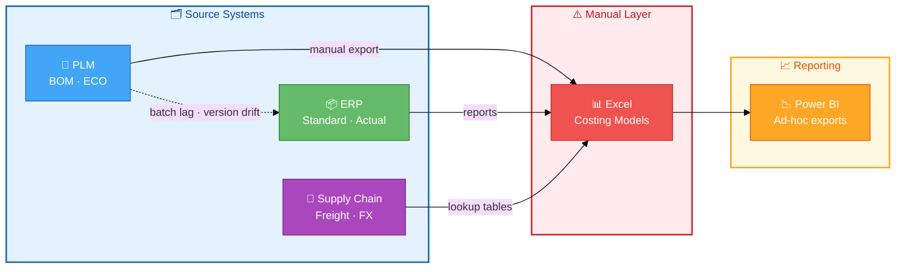
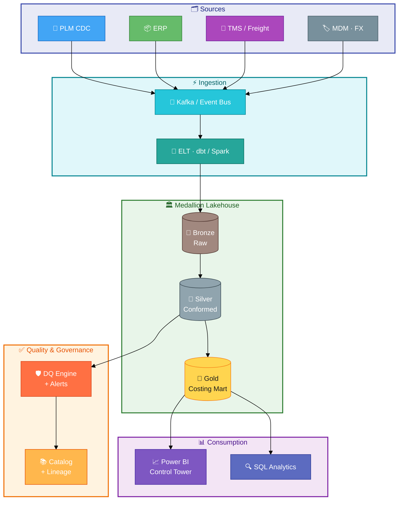
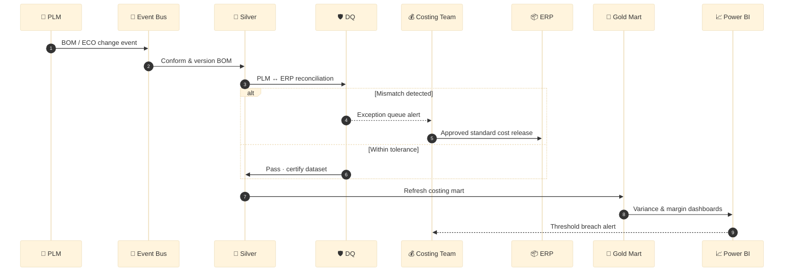

# Footwear Costing Data Solution (Case Study)

> 🇻🇳 **Tiếng Việt:** [README_VI.md](README_VI.md)

Enterprise data management case study for **footwear costing**: governance, PLM–ERP alignment, should-cost vs actual variance, and scalable analytics.

**Context (public job description):** Senior Specialist – Data Management – Footwear Costing at On (Ho Chi Minh City).

**Disclaimer:** This repository uses **synthetic data** and a **hypothetical architecture**. It is an independent portfolio project and is **not affiliated with On AG**.

**Deep dives:** [Business requirements](docs/01-business-requirements.md) · [As-is architecture](docs/02-as-is-architecture.md) · [Target architecture](docs/03-target-architecture.md) · [Governance](docs/04-data-governance.md) · [90-day roadmap](docs/05-implementation-roadmap.md)

---

## 1. Business — pain points & solution requirements

### Business context

Sport footwear brands scale through **seasonal collections**, **colorways**, and **size curves**. Costing spans **should-cost** (development), **standard cost** (ERP), and **actual / landed cost** (PO, freight, FX). A data specialist must own costing data end-to-end across PLM, ERP, supply chain, and finance.

### Pain points (as-is)

| Pain point | Business impact |
|------------|-----------------|
| BOM / version drift between PLM and ERP | Wrong standard cost, margin leakage |
| Manual Excel costing roll-ups | Slow seasonal costing, human error |
| FX / freight / MOQ volatility | Unstable landed cost |
| Multi-plant, multi-currency operations | Inconsistent COGS |
| Weak lineage and ownership | Audit risk, slow UAT |

### Symptoms → root cause

| Symptom | Root cause | Business cost |
|---------|------------|---------------|
| Margin surprise at season gate | Stale should-cost vs released standard | Delayed pricing decisions |
| Factory disputes on material usage | BOM version mismatch | Rework, claim cycles |
| Slow close | Manual actual cost allocation | Finance overtime |

### Solution requirements

| ID | Requirement | Priority | Success metric |
|----|-------------|----------|----------------|
| BR-01 | Golden costing key per SKU (style-color-size-factory-season) | P0 | 99% active SKUs with one golden key |
| BR-02 | Daily PLM–ERP BOM reconciliation + exception queue | P0 | <0.5% unresolved mismatches >48h |
| BR-03 | Should vs standard vs actual variance reporting | P0 | Supports financial close at T+3 |
| BR-04 | Lineage on every cost field | P1 | 100% monetary fields have `source_id` |
| BR-05 | Threshold alerts (variance, BOM drift, missing FX) | P1 | MTTR mismatch < 2 business days |
| BR-06 | UAT pack and rollback for cost release | P0 | Zero unplanned rollback in pilot season |
| BR-07 | Data catalog and glossary (FOB, LDP, COGS) | P2 | Glossary adopted by ≥3 functions |

### Pain point → solution pillar

| Pain point | Solution pillar |
|------------|-----------------|
| BOM / version drift | Golden record + daily reconciliation |
| Excel roll-ups | Automated pipeline + DQ rules |
| FX / freight volatility | Parameterized cost engine + alerts |
| Multi-plant / multi-currency | MDM hub + FX policy |
| Weak lineage | Governance + data catalog |

### Non-functional (summary)

- **Freshness:** costing mart T+1 (near-real-time for critical BOM).
- **Quality:** automated DQ with domain owners.
- **Security:** RBAC by region / factory.
- **Compliance:** immutable log for standard cost posts.

---

## 2. Architecture

### As-is — fragmented costing landscape

Excel sits between systems; BOM versions drift; reporting is manual.



### To-be — governed costing data platform

Event-driven ingest, medallion lakehouse, DQ gate, certified consumption.



### Target costing workflow



---

## 3. Engineering — code samples

Condensed from `python/` and `sql/` — mapped to the To-be diagram above.

| Architecture layer | Source file | Purpose |
|--------------------|-------------|---------|
| Ingest → Bronze | `python/ingest_plm_bom.py` | Idempotent PLM BOM events to event bus |
| Silver → DQ | `sql/dq_bom_reconciliation.sql` | PLM vs ERP BOM exceptions |
| Gold → Alerts | `python/costing_reconciliation.py` | Should / standard / actual variance |
| Gold schema | `sql/ddl_costing_gold_layer.sql` | Costing mart DDL |

### 3.1 Ingest PLM → Bronze

```python
# python/ingest_plm_bom.py
def bom_line_hash(product_key, component_id, qty, uom, effective_date) -> str:
    payload = f"{product_key}|{component_id}|{qty}|{uom}|{effective_date}"
    return hashlib.sha256(payload.encode()).hexdigest()

def to_bronze_event(row: dict) -> dict:
    return {
        "event_id": bom_line_hash(...),
        "source": "PLM",
        "topic": "costing.plm.bom.v1",
        "ingested_at": datetime.now(timezone.utc).isoformat(),
        "payload": row,
    }
```

### 3.2 BOM reconciliation — Silver + DQ

```sql
-- sql/dq_bom_reconciliation.sql
WITH plm AS (
    SELECT product_key, component_id, effective_date,
           SUM(quantity * (1 + scrap_rate)) AS plm_qty
    FROM silver.fact_bom_line
    WHERE source_system = 'PLM' AND is_current = TRUE
    GROUP BY 1, 2, 3
),
erp AS (
    SELECT product_key, component_id, effective_date,
           SUM(quantity) AS erp_qty
    FROM silver.fact_bom_line
    WHERE source_system = 'ERP' AND is_current = TRUE
    GROUP BY 1, 2, 3
)
SELECT product_key, component_id, plm_qty, erp_qty,
       CASE
           WHEN p.product_key IS NULL THEN 'MISSING_IN_PLM'
           WHEN e.product_key IS NULL THEN 'MISSING_IN_ERP'
           WHEN ABS(p.plm_qty - e.erp_qty) > 0.001 THEN 'QTY_MISMATCH'
           ELSE 'OK'
       END AS dq_status
FROM plm p
FULL OUTER JOIN erp e USING (product_key, component_id, effective_date)
WHERE dq_status <> 'OK';
```

### 3.3 Cost variance — Gold + alerts

```python
# python/costing_reconciliation.py
THRESHOLD_PCT = 0.05

def enrich_variance(df: pd.DataFrame) -> pd.DataFrame:
    out = df.copy()
    out["var_should_std_pct"] = (out["standard"] - out["should"]) / out["should"]
    out["var_std_actual_pct"] = (out["actual"] - out["standard"]) / out["standard"]
    out["alert"] = out["var_std_actual_pct"].abs() > THRESHOLD_PCT
    return out
```

### 3.4 Gold mart DDL

```sql
-- sql/ddl_costing_gold_layer.sql
CREATE TABLE gold_costing.fact_cost_variance (
    variance_key        VARCHAR(64) PRIMARY KEY,
    product_key         VARCHAR(64) NOT NULL,
    factory_key         VARCHAR(32) NOT NULL,
    should_cost_usd     DECIMAL(18, 4),
    standard_cost_usd   DECIMAL(18, 4),
    actual_cost_usd     DECIMAL(18, 4),
    var_std_actual_pct  DECIMAL(10, 6),
    alert_flag          BOOLEAN DEFAULT FALSE,
    as_of_date          DATE NOT NULL
);
```

### Run locally

```bash
pip install -r python/requirements.txt
python python/ingest_plm_bom.py
python python/costing_reconciliation.py
```

---

## Repository structure

```
docs/           BRD, architecture, governance, roadmap
sql/            DDL and reconciliation / variance queries
python/         Ingest and reconciliation scripts
powerbi/        Semantic model notes
data/           Synthetic sample dataset
```

## How this maps to the role

| Job requirement | Evidence in this repo |
|-----------------|------------------------|
| End-to-end costing data ownership | Section 1 BRD + gold DDL |
| Project leadership | [90-day roadmap](docs/05-implementation-roadmap.md) |
| ERP / PLM / costing systems | Section 2 architecture + BOM SQL |
| SQL, Power BI | `sql/`, `powerbi/` |
| Automation & process improvement | Section 3 Python + DQ patterns |
| Cross-functional stakeholder management | RACI in [BRD](docs/01-business-requirements.md) |

## License

MIT — see [LICENSE](LICENSE).
