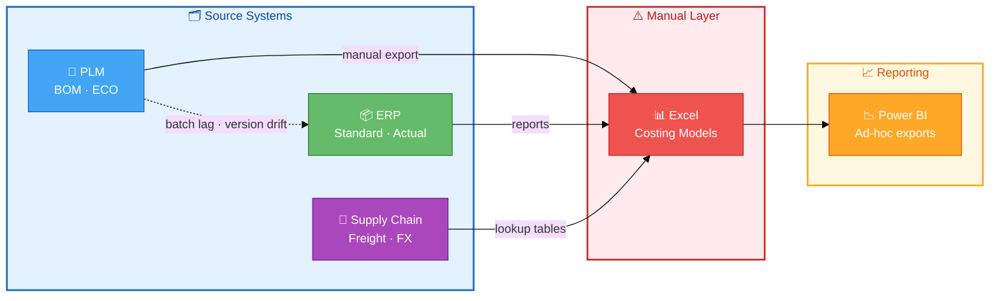
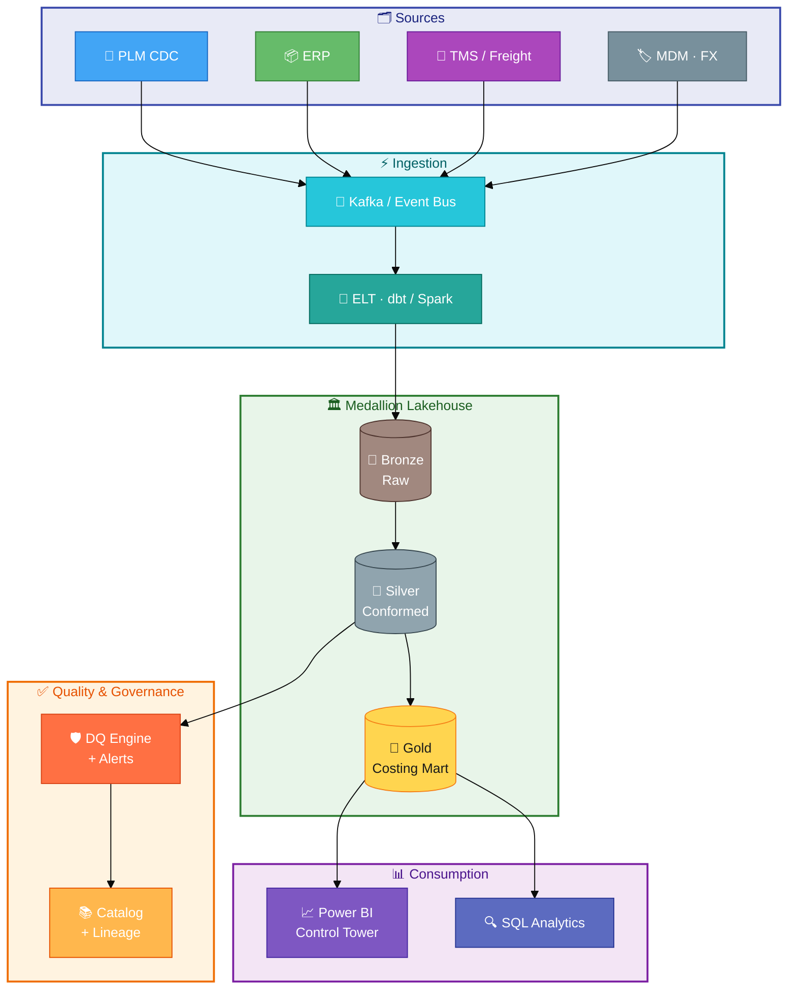
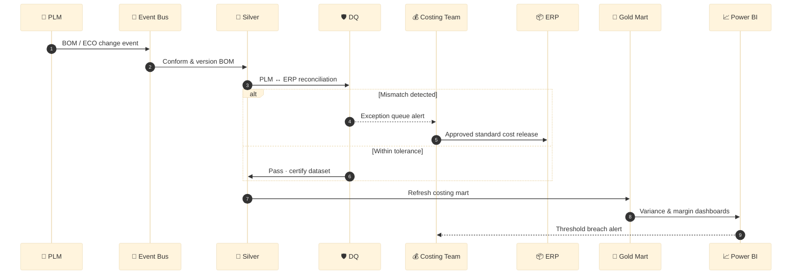

# Footwear Costing Data Solution (Case Study)

> 🇻🇳 **Tiếng Việt:** [README_VI.md](README_VI.md)

Enterprise data management case study for **footwear costing**: governance, PLM–ERP alignment, should-cost vs actual variance, and scalable analytics.

**Context (public job description):** Senior Specialist – Data Management – Footwear Costing at On (Ho Chi Minh City).

**Disclaimer:** This repository uses **synthetic data** and a **hypothetical architecture**. It is an independent portfolio project and is **not affiliated with On AG**.

---

## Architecture overview

### As-is — fragmented costing landscape

Typical pain: Excel sits between systems; BOM versions drift; reporting is manual.



| Symptom | Root cause | Business cost |
|---------|------------|---------------|
| Margin surprise at season gate | Stale should-cost vs released standard | Delayed pricing decisions |
| Factory disputes on material usage | BOM version mismatch | Rework, claim cycles |
| Slow close | Manual actual cost allocation | Finance overtime |

---

### To-be — governed costing data platform

Event-driven ingest, medallion lakehouse, DQ gate, certified consumption.



---

### Target costing workflow



---

## Pain points addressed

| Pain point | Business impact | Solution pillar |
|------------|-----------------|-----------------|
| BOM / version drift between PLM and ERP | Wrong standard cost, margin leakage | Golden record + daily reconciliation |
| Manual Excel costing roll-ups | Slow seasonal costing, human error | Automated pipeline + data quality rules |
| FX / freight / MOQ volatility | Unstable landed cost | Parameterized cost engine + alerts |
| Multi-plant, multi-currency operations | Inconsistent COGS | Master data hub + FX policy |
| Weak lineage and ownership | Audit risk, slow UAT | Data governance + catalog |

## Repository structure

```
docs/           Business requirements, as-is / to-be architecture, governance, roadmap
sql/            DDL and reconciliation / variance queries
python/         Ingest patterns and reconciliation scripts
powerbi/        Semantic model notes for costing control tower
data/           Synthetic sample dataset
```

## Quick start

```bash
pip install -r python/requirements.txt
python python/costing_reconciliation.py
```

## How this maps to the role

| Job requirement | Evidence in this repo |
|-----------------|------------------------|
| End-to-end costing data ownership | BRD, gold-layer DDL, governance doc |
| Project leadership | 90-day implementation roadmap |
| ERP / PLM / costing systems | As-is / to-be architecture, BOM reconciliation SQL |
| SQL, Power BI | `sql/`, Power BI model documentation |
| Automation & process improvement | Python ingest + DQ alerting patterns |
| Cross-functional stakeholder management | RACI and phased rollout |

## License

MIT — see [LICENSE](LICENSE).
