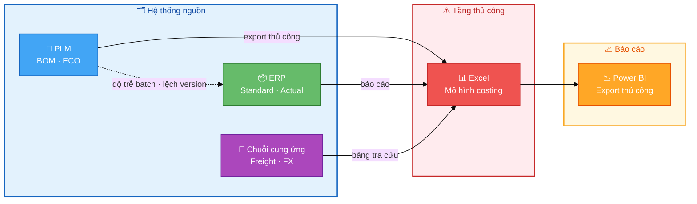
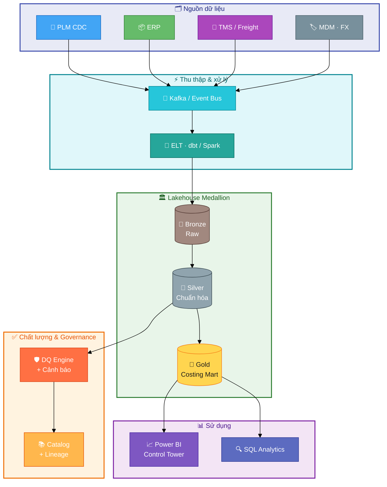
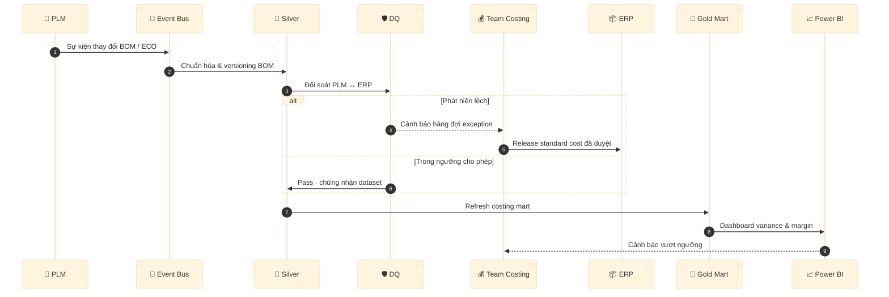

# Giải pháp Dữ liệu Costing Giày Thể thao (Case Study)

> 🇬🇧 **English:** [README.md](README.md)

Case study quản trị dữ liệu doanh nghiệp cho **costing ngành giày**: governance, đồng bộ PLM–ERP, phân tích chênh lệch should-cost / standard / actual, và analytics có thể mở rộng.

**Bối cảnh (JD công khai):** Senior Specialist – Data Management – Footwear Costing tại On (TP. Hồ Chí Minh).

**Lưu ý:** Repo dùng **dữ liệu giả lập** và **kiến trúc giả định**. Đây là dự án portfolio độc lập, **không liên kết với On AG**.

**Chi tiết:** [BRD](docs/01-business-requirements.md) · [Kiến trúc hiện trạng](docs/02-as-is-architecture.md) · [Kiến trúc mục tiêu](docs/03-target-architecture.md) · [Governance](docs/04-data-governance.md) · [Roadmap 90 ngày](docs/05-implementation-roadmap.md)

---

## 1. Business — pain point & yêu cầu giải pháp

### Bối cảnh nghiệp vụ

Brand giày thể thao scale theo **season**, **colorway**, **size curve**. Costing gồm **should-cost** (phát triển / đàm phán), **standard cost** (ERP), **actual / landed cost** (PO, freight, FX). Specialist data phải **sở hữu dữ liệu costing end-to-end** giữa PLM, ERP, supply chain và finance.

### Pain point (hiện trạng)

| Pain point | Tác động kinh doanh |
|------------|---------------------|
| BOM / version lệch giữa PLM và ERP | Sai standard cost, rò margin |
| Tổng hợp costing bằng Excel | Chậm theo season, lỗi thủ công |
| Biến động FX / freight / MOQ | Landed cost không ổn định |
| Đa nhà máy, đa tiền tệ | COGS không nhất quán |
| Thiếu lineage & ownership | Rủi ro audit, UAT chậm |

### Triệu chứng → nguyên nhân gốc

| Triệu chứng | Nguyên nhân gốc | Tác động |
|-------------|-----------------|----------|
| Lệch margin khi mở season | Should-cost cũ so với standard đã release | Trễ quyết định giá |
| Tranh chấp với nhà máy về định mức | BOM PLM ≠ ERP | Rework, claim |
| Đóng sổ chậm | Phân bổ actual cost thủ công | OT Finance |

### Yêu cầu giải pháp (solution requirements)

| ID | Yêu cầu | Ưu tiên | Chỉ số thành công |
|----|---------|---------|-------------------|
| BR-01 | Golden key SKU (style-color-size-factory-season) | P0 | 99% SKU active có một key |
| BR-02 | Đối soát BOM PLM–ERP hàng ngày + hàng đợi exception | P0 | <0.5% lệch chưa xử lý >48h |
| BR-03 | Báo cáo should / standard / actual variance | P0 | Hỗ trợ close sổ T+3 |
| BR-04 | Lineage trên mọi trường cost | P1 | 100% trường tiền có `source_id` |
| BR-05 | Cảnh báo ngưỡng (variance, BOM, FX) | P1 | MTTR lệch < 2 ngày làm việc |
| BR-06 | UAT + rollback khi release cost | P0 | Không rollback ngoài ý muốn ở pilot |
| BR-07 | Catalog + glossary (FOB, LDP, COGS) | P2 | Glossary dùng bởi ≥3 bộ phận |

### Pain point → trụ cột giải pháp

| Pain point | Trụ cột giải pháp |
|------------|-------------------|
| Lệch BOM / version | Golden record + đối soát hàng ngày |
| Excel roll-up | Pipeline tự động + rule DQ |
| FX / freight | Cost engine tham số hóa + alert |
| Đa nhà máy / tiền tệ | MDM hub + chính sách FX |
| Thiếu lineage | Governance + data catalog |

### Phi chức năng (tóm tắt)

- **Freshness:** mart costing T+1 (BOM critical gần real-time).
- **Quality:** DQ tự động, có owner từng domain.
- **Security:** RBAC theo region / factory.
- **Compliance:** log bất biến cho standard cost post.

---

## 2. Kiến trúc (Architecture)

### Hiện trạng (As-is) — hệ thống costing phân mảnh

Excel là cầu nối thủ công; BOM lệch phiên bản; báo cáo không tự động.



### Mục tiêu (To-be) — nền tảng dữ liệu có governance

Ingest theo sự kiện, lakehouse medallion, cổng DQ, consumption đã chứng nhận.



### Quy trình costing mục tiêu



---

## 3. Engineering — mẫu code

Rút gọn từ `python/` và `sql/` — map vào sơ đồ To-be ở mục 2.

| Tầng kiến trúc | File | Việc làm |
|----------------|------|----------|
| Ingest → Bronze | `python/ingest_plm_bom.py` | Event BOM PLM, `event_id` idempotent |
| Silver → DQ | `sql/dq_bom_reconciliation.sql` | Đối soát PLM vs ERP |
| Gold → Alert | `python/costing_reconciliation.py` | Variance should / standard / actual |
| Gold schema | `sql/ddl_costing_gold_layer.sql` | DDL mart costing |

### 3.1 Ingest PLM → Bronze

```python
# python/ingest_plm_bom.py
def bom_line_hash(product_key, component_id, qty, uom, effective_date) -> str:
    payload = f"{product_key}|{component_id}|{qty}|{uom}|{effective_date}"
    return hashlib.sha256(payload.encode()).hexdigest()

def to_bronze_event(row: dict) -> dict:
    return {
        "event_id": bom_line_hash(...),
        "source": "PLM",
        "topic": "costing.plm.bom.v1",
        "ingested_at": datetime.now(timezone.utc).isoformat(),
        "payload": row,
    }
```

### 3.2 Đối soát BOM — Silver + DQ

```sql
-- sql/dq_bom_reconciliation.sql
WITH plm AS (
    SELECT product_key, component_id, effective_date,
           SUM(quantity * (1 + scrap_rate)) AS plm_qty
    FROM silver.fact_bom_line
    WHERE source_system = 'PLM' AND is_current = TRUE
    GROUP BY 1, 2, 3
),
erp AS (
    SELECT product_key, component_id, effective_date,
           SUM(quantity) AS erp_qty
    FROM silver.fact_bom_line
    WHERE source_system = 'ERP' AND is_current = TRUE
    GROUP BY 1, 2, 3
)
SELECT product_key, component_id, plm_qty, erp_qty,
       CASE
           WHEN p.product_key IS NULL THEN 'MISSING_IN_PLM'
           WHEN e.product_key IS NULL THEN 'MISSING_IN_ERP'
           WHEN ABS(p.plm_qty - e.erp_qty) > 0.001 THEN 'QTY_MISMATCH'
           ELSE 'OK'
       END AS dq_status
FROM plm p
FULL OUTER JOIN erp e USING (product_key, component_id, effective_date)
WHERE dq_status <> 'OK';
```

### 3.3 Variance costing — Gold + cảnh báo

```python
# python/costing_reconciliation.py
THRESHOLD_PCT = 0.05

def enrich_variance(df: pd.DataFrame) -> pd.DataFrame:
    out = df.copy()
    out["var_should_std_pct"] = (out["standard"] - out["should"]) / out["should"]
    out["var_std_actual_pct"] = (out["actual"] - out["standard"]) / out["standard"]
    out["alert"] = out["var_std_actual_pct"].abs() > THRESHOLD_PCT
    return out
```

### 3.4 DDL Gold layer

```sql
-- sql/ddl_costing_gold_layer.sql
CREATE TABLE gold_costing.fact_cost_variance (
    variance_key        VARCHAR(64) PRIMARY KEY,
    product_key         VARCHAR(64) NOT NULL,
    factory_key         VARCHAR(32) NOT NULL,
    should_cost_usd     DECIMAL(18, 4),
    standard_cost_usd   DECIMAL(18, 4),
    actual_cost_usd     DECIMAL(18, 4),
    var_std_actual_pct  DECIMAL(10, 6),
    alert_flag          BOOLEAN DEFAULT FALSE,
    as_of_date          DATE NOT NULL
);
```

### Chạy local

```bash
pip install -r python/requirements.txt
python python/ingest_plm_bom.py
python python/costing_reconciliation.py
```

---

## Cấu trúc repository

```
docs/           BRD, kiến trúc, governance, roadmap
sql/            DDL và query đối soát / variance
python/         Mẫu ingest và reconciliation
powerbi/        Ghi chú semantic model
data/           Dataset mẫu giả lập
```

## Ánh xạ với JD

| Yêu cầu công việc | Bằng chứng trong repo |
|-------------------|------------------------|
| Sở hữu end-to-end dữ liệu costing | Mục 1 + DDL gold |
| Lãnh đạo dự án | [Roadmap 90 ngày](docs/05-implementation-roadmap.md) |
| ERP / PLM / costing | Mục 2 + SQL BOM |
| SQL, Power BI | `sql/`, `powerbi/` |
| Tự động hóa | Mục 3 Python + DQ |
| Phối hợp đa bộ phận | RACI trong [BRD](docs/01-business-requirements.md) |

## Giấy phép

MIT — xem [LICENSE](LICENSE).
