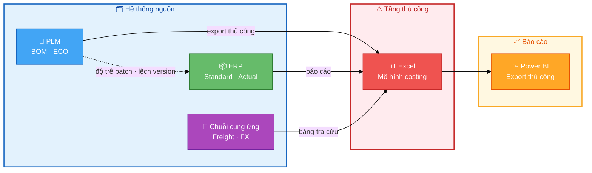
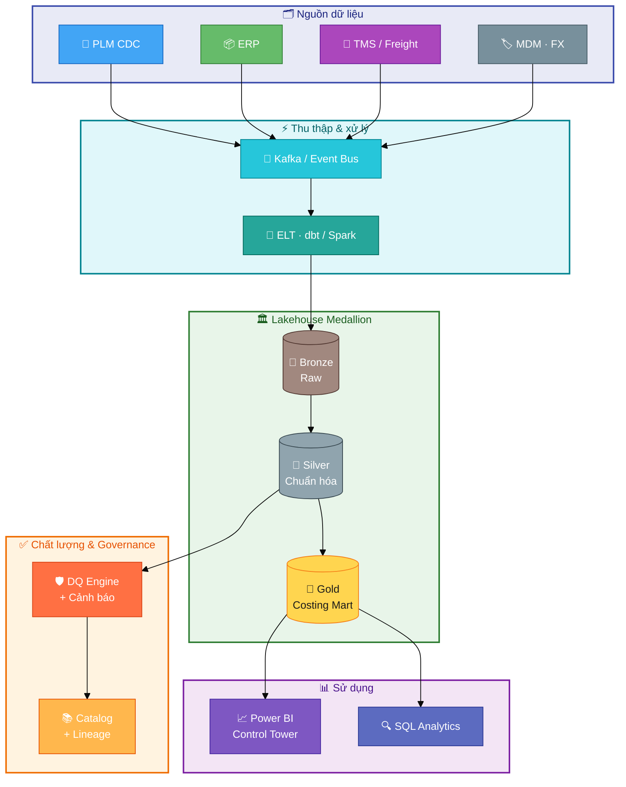
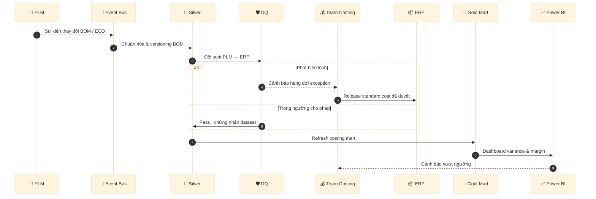

# Giải pháp Dữ liệu Costing Giày Thể thao (Case Study)

> 🇬🇧 **English:** [README.md](README.md)

Case study quản trị dữ liệu doanh nghiệp cho **costing ngành giày**: governance, đồng bộ PLM–ERP, phân tích chênh lệch should-cost / standard / actual, và analytics có thể mở rộng.

**Bối cảnh (JD công khai):** Senior Specialist – Data Management – Footwear Costing tại On (TP. Hồ Chí Minh).

**Lưu ý:** Repo dùng **dữ liệu giả lập** và **kiến trúc giả định**. Đây là dự án portfolio độc lập, **không liên kết với On AG**.

---

## Tổng quan kiến trúc

### Hiện trạng (As-is) — hệ thống costing phân mảnh

Vấn đề điển hình: Excel là cầu nối thủ công; BOM lệch phiên bản; báo cáo không tự động.



| Triệu chứng | Nguyên nhân gốc | Tác động kinh doanh |
|-------------|-----------------|---------------------|
| Lệch margin khi mở season | Should-cost cũ so với standard đã release | Trễ quyết định giá |
| Tranh chấp với nhà máy về định mức | BOM PLM ≠ ERP | Rework, claim |
| Đóng sổ chậm | Phân bổ actual cost thủ công | OT cho Finance |

---

### Mục tiêu (To-be) — nền tảng dữ liệu costing có governance

Ingest theo sự kiện, lakehouse medallion, cổng DQ, consumption đã chứng nhận.



---

### Quy trình costing mục tiêu



---

## Mẫu code theo kiến trúc (đọc nhanh)

Các đoạn dưới **rút gọn** từ `python/` và `sql/` — map trực tiếp vào sơ đồ To-be ở trên.

| Tầng kiến trúc | File đầy đủ | Việc làm |
|----------------|-------------|----------|
| **Ingest → Bronze** | `python/ingest_plm_bom.py` | Nhận BOM từ PLM, tạo `event_id` idempotent, đẩy event bus |
| **Silver → DQ** | `sql/dq_bom_reconciliation.sql` | Đối soát BOM PLM vs ERP, xuất exception queue |
| **Gold → Alert** | `python/costing_reconciliation.py` | So sánh should / standard / actual, gắn cờ vượt ngưỡng |
| **Gold schema** | `sql/ddl_costing_gold_layer.sql` | Định nghĩa bảng mart costing |

### 1) Ingest PLM → Bronze (Kafka / landing)

```python
# python/ingest_plm_bom.py — tầng Ingest
def bom_line_hash(product_key, component_id, qty, uom, effective_date) -> str:
    payload = f"{product_key}|{component_id}|{qty}|{uom}|{effective_date}"
    return hashlib.sha256(payload.encode()).hexdigest()

def to_bronze_event(row: dict) -> dict:
    return {
        "event_id": bom_line_hash(...),      # trùng lặp → cùng key, không double-count
        "source": "PLM",
        "topic": "costing.plm.bom.v1",       # map vào Event Bus trong sơ đồ
        "ingested_at": datetime.now(timezone.utc).isoformat(),
        "payload": row,                       # BOM line thô
    }
```

**Ý nghĩa:** Mỗi dòng BOM là một event; ELT phía sau ghi vào **Bronze** rồi chuẩn hóa lên **Silver**.

---

### 2) Đối soát BOM — Silver + DQ

```sql
-- sql/dq_bom_reconciliation.sql — cổng DQ trước khi publish Gold
WITH plm AS (
    SELECT product_key, component_id, effective_date,
           SUM(quantity * (1 + scrap_rate)) AS plm_qty
    FROM silver.fact_bom_line
    WHERE source_system = 'PLM' AND is_current = TRUE
    GROUP BY 1, 2, 3
),
erp AS (
    SELECT product_key, component_id, effective_date,
           SUM(quantity) AS erp_qty
    FROM silver.fact_bom_line
    WHERE source_system = 'ERP' AND is_current = TRUE
    GROUP BY 1, 2, 3
)
SELECT product_key, component_id,
       plm_qty, erp_qty,
       CASE
           WHEN p.product_key IS NULL THEN 'MISSING_IN_PLM'
           WHEN e.product_key IS NULL THEN 'MISSING_IN_ERP'
           WHEN ABS(p.plm_qty - e.erp_qty) > 0.001 THEN 'QTY_MISMATCH'
           ELSE 'OK'
       END AS dq_status
FROM plm p
FULL OUTER JOIN erp e USING (product_key, component_id, effective_date)
WHERE dq_status <> 'OK';   -- chỉ giữ exception → queue cho team Costing
```

**Ý nghĩa:** Khớp với bước **“Đối soát PLM ↔ ERP”** trong sequence diagram — lệch BOM thì **không** cho costing chạy im lặng.

---

### 3) Variance should / standard / actual — Gold + cảnh báo

```python
# python/costing_reconciliation.py — tầng Gold / Consumption
THRESHOLD_PCT = 0.05   # vượt 5% → alert Power BI / email

def enrich_variance(df: pd.DataFrame) -> pd.DataFrame:
    out = df.copy()
    out["var_should_std_pct"] = (out["standard"] - out["should"]) / out["should"]
    out["var_std_actual_pct"] = (out["actual"] - out["standard"]) / out["standard"]
    out["alert"] = out["var_std_actual_pct"].abs() > THRESHOLD_PCT
    return out

# Ví dụ output (data/sample_costing.csv):
#   SKU              should  standard  actual  alert
#   LIFE-02-WHT-44   42.00   41.50     44.80   True  → điều tra freight / FX / yield
```

**Ý nghĩa:** Mart **Gold** (`fact_cost_variance`) phục vụ Control Tower; costing analyst nhận **driver_hint** thay vì chỉ nhìn số thô.

---

### 4) DDL Gold layer (schema mart)

```sql
-- sql/ddl_costing_gold_layer.sql — ví dụ bảng trung tâm
CREATE TABLE gold_costing.fact_cost_variance (
    variance_key        VARCHAR(64) PRIMARY KEY,
    product_key         VARCHAR(64) NOT NULL,   -- style-color-size-season
    factory_key         VARCHAR(32) NOT NULL,
    should_cost_usd     DECIMAL(18, 4),
    standard_cost_usd   DECIMAL(18, 4),
    actual_cost_usd     DECIMAL(18, 4),
    var_std_actual_pct  DECIMAL(10, 6),
    alert_flag          BOOLEAN DEFAULT FALSE,
    as_of_date          DATE NOT NULL
);
```

**Ý nghĩa:** Một **golden grain** cho mỗi SKU–factory–kỳ; Power BI / SQL đọc từ đây thay vì Excel.

---

### Chạy local để xem output

```bash
pip install -r python/requirements.txt
python python/ingest_plm_bom.py          # in JSON event Bronze
python python/costing_reconciliation.py # in bảng variance + số alert
```

---

## Pain point được giải quyết

| Pain point | Tác động kinh doanh | Trụ cột giải pháp |
|------------|---------------------|-------------------|
| BOM / version lệch giữa PLM và ERP | Sai standard cost, rò margin | Golden record + đối soát hàng ngày |
| Tổng hợp costing bằng Excel | Chậm theo season, lỗi thủ công | Pipeline tự động + rule DQ |
| Biến động FX / freight / MOQ | Landed cost không ổn định | Cost engine tham số hóa + alert |
| Đa nhà máy, đa tiền tệ | COGS không nhất quán | MDM hub + chính sách FX |
| Thiếu lineage & ownership | Rủi ro audit, UAT chậm | Governance + data catalog |

## Cấu trúc repository

```
docs/           BRD, kiến trúc as-is / to-be, governance, roadmap
sql/            DDL và query đối soát / variance
python/         Mẫu ingest và reconciliation
powerbi/        Ghi chú semantic model control tower
data/           Dataset mẫu giả lập
```

## Chạy thử nhanh

```bash
pip install -r python/requirements.txt
python python/costing_reconciliation.py
```

## Ánh xạ với JD

| Yêu cầu công việc | Bằng chứng trong repo |
|-------------------|------------------------|
| Sở hữu end-to-end dữ liệu costing | BRD, DDL gold layer, doc governance |
| Lãnh đạo dự án | Roadmap triển khai 90 ngày |
| ERP / PLM / hệ thống costing | Kiến trúc, SQL đối soát BOM |
| SQL, Power BI | Thư mục `sql/`, tài liệu Power BI |
| Tự động hóa & cải tiến quy trình | Python ingest + pattern cảnh báo DQ |
| Phối hợp đa bộ phận | RACI và rollout theo phase |

## Giấy phép

MIT — xem [LICENSE](LICENSE).
