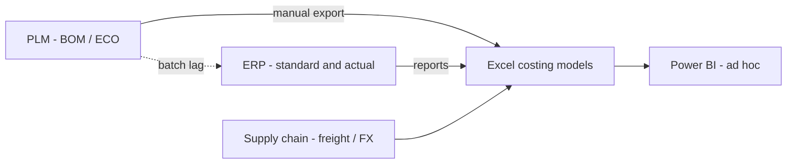

# As-Is Architecture

## Current-state pattern (typical footwear matrix organization)

## Symptoms

| Symptom | Root cause | Business cost |
|---------|------------|---------------|
| Margin surprise at season gate | Stale should-cost vs released standard | Delayed pricing decisions |
| Factory disputes on material usage | BOM version mismatch | Rework, claim cycles |
| Slow close | Manual actual cost allocation | Finance overtime |
| Duplicate SKU keys | No golden product hierarchy | Broken joins in reporting |

## System inventory (illustrative)

| System | Role | Data domains |
|--------|------|--------------|
| PLM | Style development, BOM, ECO | Components, quantities, scrap % |
| ERP | Standard cost, inventory, PO actuals | GL, COGS, receipts |
| TMS / 3PL | Freight lanes | Landed cost inputs |
| MDM | Vendors, FX, UoM | Reference data |
| Excel | Negotiation models, bridges | Should-cost, scenarios |

## Key integration gaps

1. No **event-driven** sync when BOM changes in PLM.
2. Cost components lack **effective dating** aligned to season calendar.
3. Reporting layer has **no DQ SLA** or ownership.
