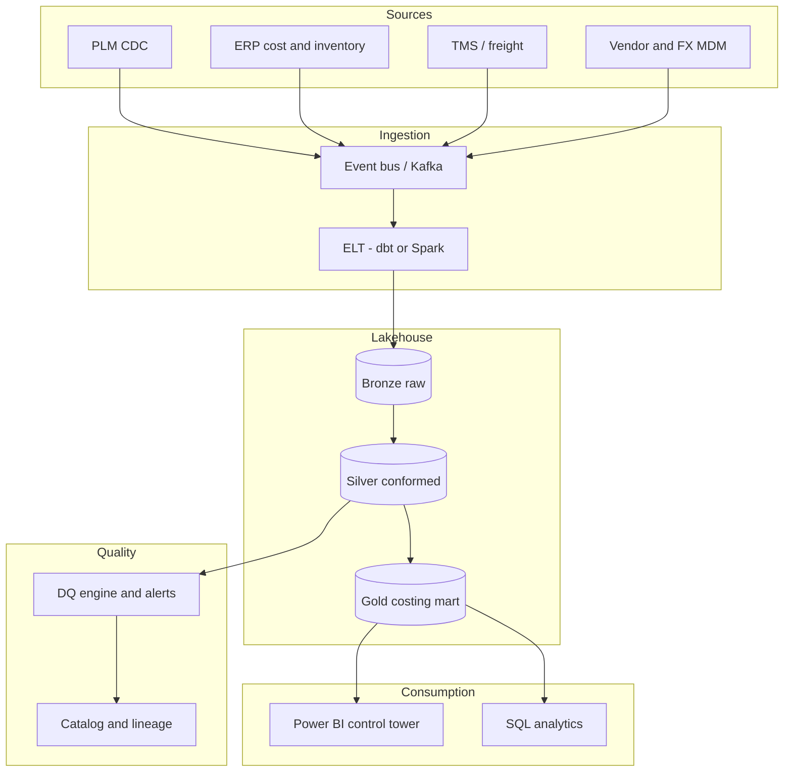

# Target Architecture

## Design principles

1. **Single golden costing record** per SKU-factory-season.
2. **PLM and ERP converge in silver**, publish **gold marts** for BI and finance.
3. **DQ before publish** — no dashboard without certified datasets.
4. **Lineage by default** — source system, batch id, and version on every fact.

## To-be logical architecture

## Gold-layer entities

| Entity | Grain | Purpose |
|--------|-------|---------|
| `dim_product` | Style × colorway × season | Product hierarchy |
| `dim_factory` | Factory | Manufacturing site |
| `fact_bom_line` | SKU × component × effective date | BOM reconciliation |
| `fact_cost_component` | SKU × cost type × version | Material, labor, overhead |
| `fact_standard_cost_snapshot` | SKU × snapshot date | Released standard |
| `fact_po_actual_cost` | SKU × PO line | Landed actuals |
| `fact_cost_variance` | SKU × period | Should / standard / actual |

## Costing workflow (target)

1. PLM publishes BOM change event.
2. Silver layer computes **effective BOM** and compares to ERP.
3. Exceptions route to **costing queue** (Teams / Jira).
4. Approved standard cost release writes to ERP (controlled job).
5. Gold mart refreshes; Power BI alerts on threshold breach.
